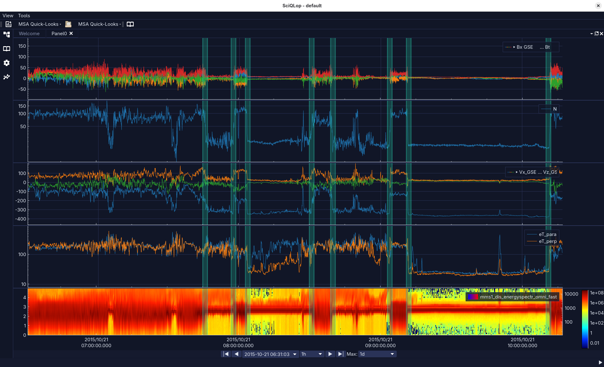

<div style="text-align:center">

<br /><br />

</div>


# Overview

**SciQLOP** (**SCI**entific **Q**t application for **L**earning from **O**bservations of **P**lasmas) aims to be an ergonomic
and powerful tool enabling visualization and analysis of in-situ space plasma data. This goal rises some
challenges either technical and in the conception and the design.
The time resolution allowed by nowadays measurements imply the ability to plot millions of points just for
one sensor with no compromise on interactivity. Plots may stay responsive even with millions of points.
Being able to scroll, zoom, move and export the plots with the mouse are the minimal interactions expected by the user.
SciQLOP may also abstract the manipulation of physic data while providing contextual features such as
coordinate transform, physical quantity extraction from data.
That said increasing graphical features usually lead to slower software and more complex GUI. Keeping
SciQLOP lightweight and intuitive is one of the priorities to make it usable and competitive.


## How to build

```
git clone https://github.com/SciQLop/SciQLop
cd SciQLop
mkdir build && cd build
meson
ninja
```


## How to contribute

Contact sciqlop@lpp.polytechnique.fr
