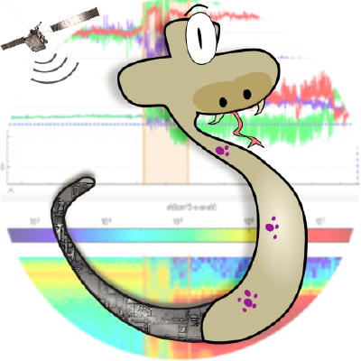
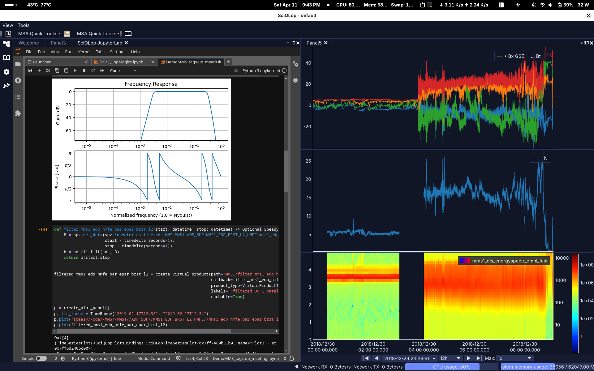
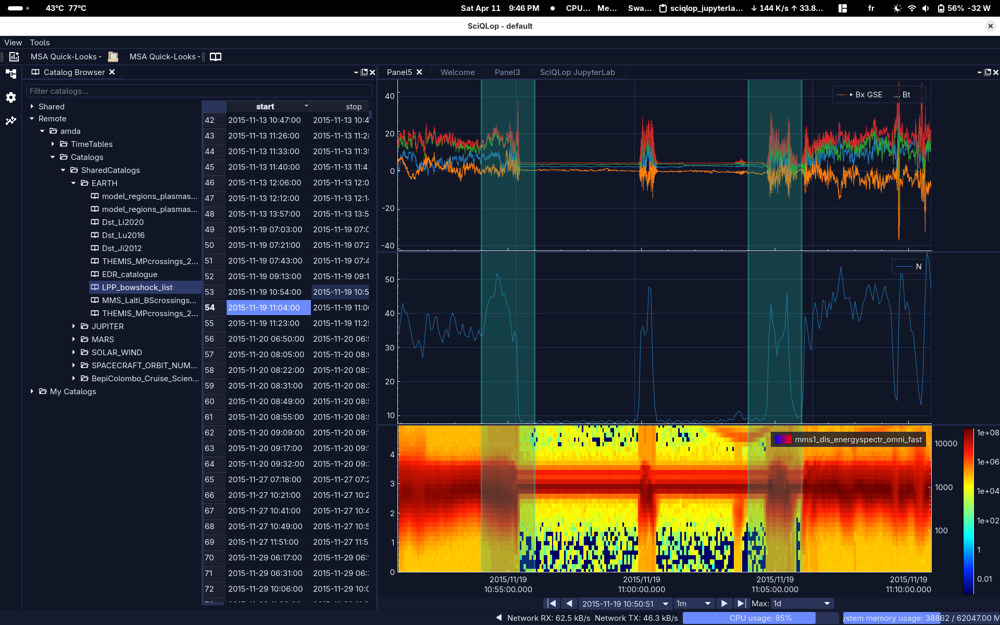
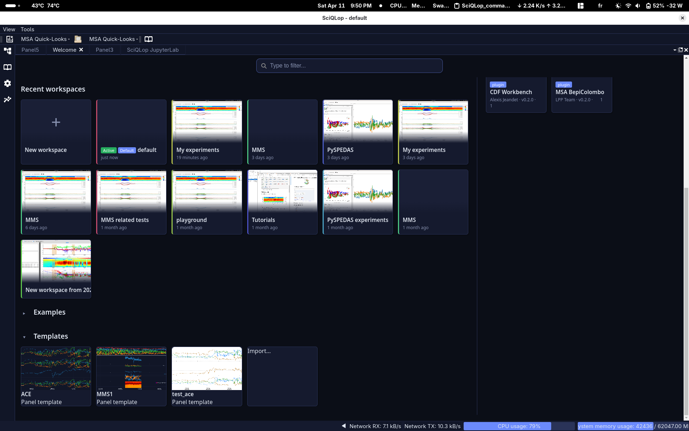

<div style="text-align:center">

</div>
<br /><br />

# [**Latest release**](https://github.com/SciQLop/SciQLop/releases/latest)

# What Is SciQLop?

**SciQLop** (**SCI**entific **Q**t application for **L**earning from **O**bservations of **P**lasmas) is a powerful and
user-friendly tool designed for the visualization and analysis of in-situ space plasma data.

Using SciQLop will let you:

- have a super easy access to tens of thousands of products from the top main data archives in the world,
- explore multivariate time series effortlessly, with lightning-fast and transparent downloads as you scroll, zoom in,
  and zoom out,should
- visualize custom products with simple python code executed on-the-fly,
- easily label time intervals and make or edit catalog of events graphically and rapidely,
- analyze your data in jupyter notebooks,

<div style="text-align:center">

</div>

Heliophysicists now benefit from decades of space exploration through many spacecraft missions.
Exploring this massive amount of data to find events of interest, build catalogs, and conduct statistical multi-mission
data analysis
can be a daunting task if not having the right tool.

SciQLop aims at being this tool! A simple lightweight yet powerful graphical interface coupled to the limitless options
brought by the Jupyter Notebook integration,
that focuses on providing users with the easiest possible way to explore, label and analyze huge amounts of data.
SciQLop is also the right tool for teaching space physics and in situ spacecraft data handling to students effortlessly.

# Main Features

- **Interactive and responsive**: SciQLop can handle millions of data points without compromising on interactivity.
  Users can scroll, zoom, move, and export plots with ease.

  

- **User-friendly**: Accessing data in SciQLop is as simple as a drag and drop from the tens of thousands of products
  readily available.
  Custom user products defined in Python behave exactly the same way and bring infinite possibilities.

  

- **Jupyter notebook integration**: SciQLop can be used as a backend for Jupyter notebooks, allowing users to create and
  manipulate plots from within their notebooks, define new products and much more.

  

- **Catalogs**: SciQLop provides a catalog system that allows users to easily label events in their data or visualize
  existing catalogs of events.

  

- **Evolving and growing list of examples**: SciQLop comes with a growing list of examples that demonstrate how to
  perform common tasks such as loading data, creating plots, and using the catalog system.

  

## Upcoming features

- **community-driven plugins repository**: SciQLop will soon have a plugin system that will allow users to extend the
  software's capabilities by installing community-driven plugins.
- **catalogs coediting**: SciQLop will allow users to coedit catalogs, making it easier to collaborate on event
  labeling and visualization, thereby also improving reproducibility of space physics studies.

# How to install SciQLop

## Mac Users

Since SciQLop 0.7.1 we produce a Mac App Bundle that you can download from
the [latest release](https://github.com/SciQLop/SciQLop/releases/latest) page just pick the
right architecture for your Mac (ARM64 for Apple M1/2/3 chips and x86_64 for intel ones).

## Linux Users

If you are using a Linux distribution, you may not need to install anything, you can just download the AppImage from the
[latest release](https://github.com/SciQLop/SciQLop/releases/latest) and run it (after making it executable).

## From sources

Since SciQLop depends on specific versions of PySide6 you might prefer to use a dedicated virtualenv for SciQLop to
avoid any conflict with any other Python package already installed in your system.

- Using releases from PyPi

```Bash
python -m pip install sciqlop
```

- Using the latest code from GitHub

```Bash
python -m pip install git+https://github.com/SciQLop/SciQLop
```

Once installed the sciqlop launcher should be in your PATH and you should be able to start SciQLop from your terminal.

```Bash
sciqlop
```

or

```Bash
python -m SciQLop.app
```

# Python user API Examples:

SciQLop has a public API that allows users to create custom products and plots. Here are some examples:

- Creating plot panels:

```python
from SciQLop.user_api import TimeRange
from SciQLop.user_api.plot import create_plot_panel
from datetime import datetime

# all plots are stacked
p = create_plot_panel()
p.time_range = TimeRange(datetime(2015, 10, 22, 6, 4, 30), datetime(2015, 10, 22, 6, 6, 0))
p.plot("speasy/cda/MMS/MMS1/FGM/MMS1_FGM_BRST_L2/mms1_fgm_b_gsm_brst_l2")
p.plot("speasy/cda/MMS/MMS1/DIS/MMS1_FPI_BRST_L2_DIS_MOMS/mms1_dis_bulkv_gse_brst")
p.plot("speasy/cda/MMS/MMS1/DIS/MMS1_FPI_BRST_L2_DIS_MOMS/mms1_dis_energyspectr_omni_brst")

# tha_peif_sc_pot and tha_peif_en_eflux will share the same plot 
p2 = create_plot_panel()
p2.plot("speasy/cda/THEMIS/THA/L2/THA_L2_ESA/tha_peif_en_eflux")
p2.plots[0].plot("speasy/cda/THEMIS/THA/L2/THA_L2_ESA/tha_peif_sc_pot")
p2.plot("speasy/cda/THEMIS/THA/L2/THA_L2_ESA/tha_peif_velocity_dsl")
```

> **_NOTE:_**  An easy way to get product paths, is to drag a product from Products Tree to any text zone or even your
> Python terminal.

- Custom products AKA virtual products:

```python

import numpy as np
from SciQLop.user_api.virtual_products import create_virtual_product, VirtualProductType
from SciQLop.user_api.plot import create_plot_panel
import speasy as spz


# define a custom product that calculates the magnitude of the magnetic field measured by ACE

def ace_b_magnitude(start: float, stop: float) -> spz.SpeasyVariable:
  b_gse = spz.get_data(spz.inventories.tree.amda.Parameters.ACE.MFI.ace_imf_all.imf, start, stop)
  return np.sqrt(b_gse["bx"] ** 2 + b_gse["by"] ** 2 + b_gse["bz"] ** 2)


ace_b_magnitude_virtual_prod = create_virtual_product(path='my_virtual_products/ace_b_magnitude',
                                                      product_type=VirtualProductType.Scalar, callback=ace_b_magnitude,
                                                      labels=["|b|"])

# plot the virtual product
p = create_plot_panel()
p.plot(ace_b_magnitude_virtual_prod)
```

More examples can be found in the [examples](SciQLop/examples) folder, they are also available from the welcome screen.

# How to contribute

Just fork the repository, make your changes and submit a pull request. We will be happy to review and merge your
changes.
Reports of bugs and feature requests are also welcome. Do not forget to star the project if you like it!

# Credits

The development of SciQLop is supported by the [CDPP](http://www.cdpp.eu/).<br />
We acknowledge support from the federation [Plas@Par](https://www.plasapar.sorbonne-universite.fr)

# Thanks

We would like to thank the developers of the following libraries that SciQLop depends on:

- [PySide6](https://doc.qt.io/qtforpython-6/index.html) for the GUI framework and Qt bindings.
- [QCustomPlot](https://www.qcustomplot.com/) for providing the plotting library.
- [DiskCache](https://pypi.org/project/diskcache/) for providing a simple and efficient caching system used
  in [Speasy](https://github.com/SciQLop/speasy).
- [The Jupyter project](https://jupyter.org/) for providing the Jupyter notebook integration.
- [Numpy](https://numpy.org/) for providing fast Python array library.
