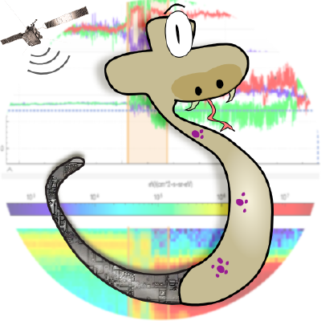
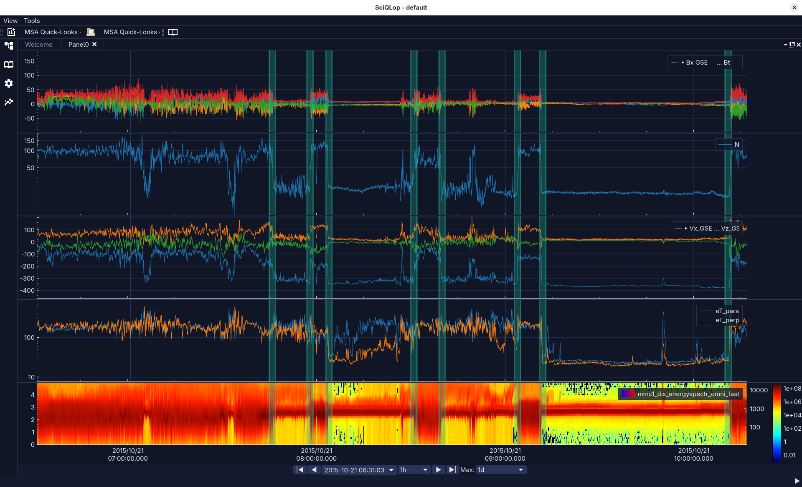
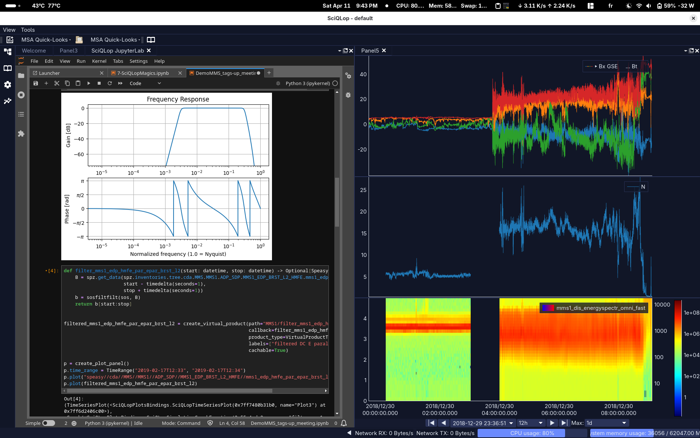
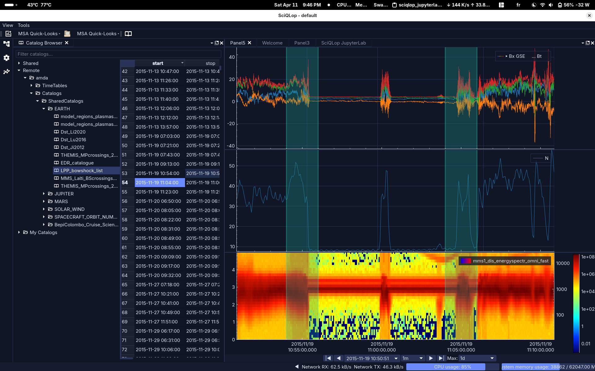
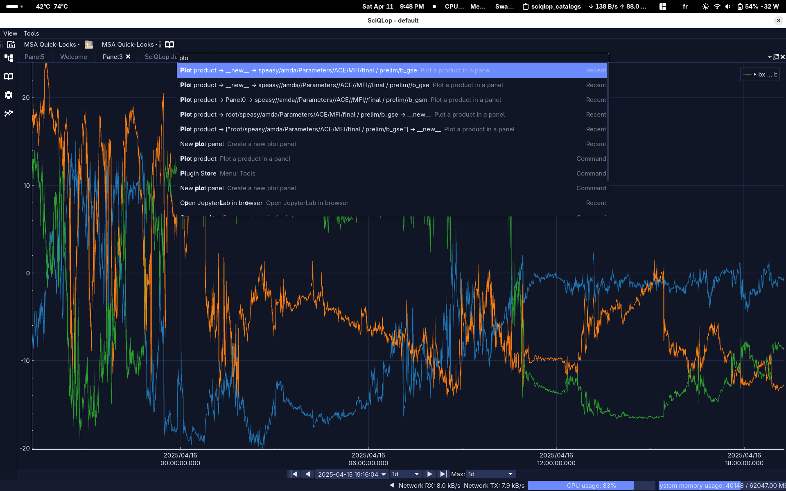
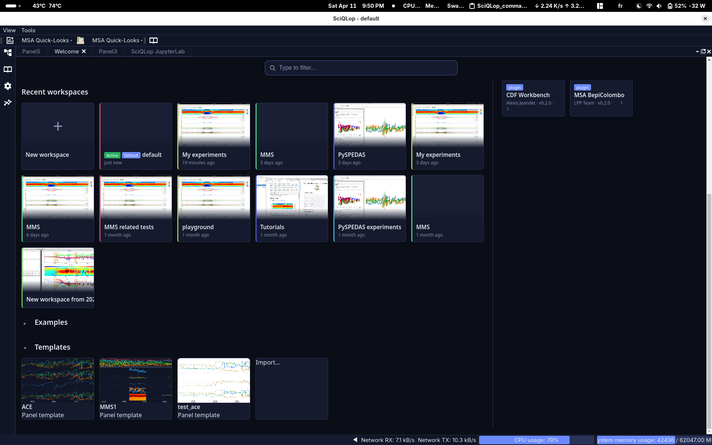
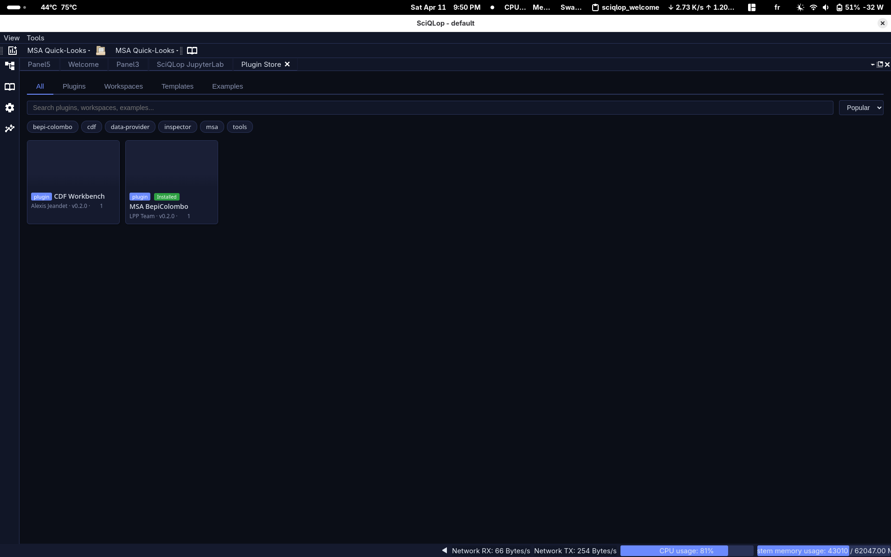
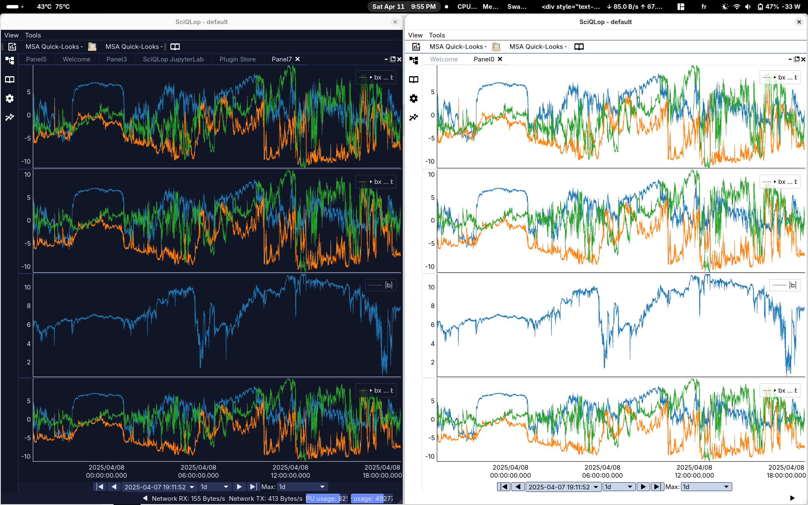

<div style="text-align:center">

</div>
<br /><br />

# [**Latest release**](https://github.com/SciQLop/SciQLop/releases/latest)

# What Is SciQLop?

**SciQLop** (**SCI**entific **Q**t application for **L**earning from **O**bservations of **P**lasmas) is a powerful and
user-friendly tool designed for the visualization and analysis of in-situ space plasma data.

Using SciQLop will let you:

- have super easy access to tens of thousands of products from the top main data archives in the world,
- explore multivariate time series effortlessly, with lightning-fast and transparent downloads as you scroll, zoom in,
  and zoom out,
- visualize custom products with simple Python code executed on-the-fly,
- easily label time intervals and make or edit catalogs of events graphically and rapidly,
- collaborate on catalog editing in real time with other users,
- analyze your data in Jupyter notebooks side by side with interactive plots,
- extend SciQLop with community plugins from the built-in App Store,

<!-- TODO: replace with an up-to-date screenshot of the main SciQLop window showing the current UI (dark theme, panels, catalog overlay, product tree) -->
<div style="text-align:center">

</div>

Heliophysicists now benefit from decades of space exploration through many spacecraft missions.
Exploring this massive amount of data to find events of interest, build catalogs, and conduct statistical multi-mission
data analysis can be a daunting task without the right tool.

SciQLop aims at being this tool! A simple lightweight yet powerful graphical interface coupled to the limitless options
brought by the Jupyter notebook integration, that focuses on providing users with the easiest possible way to explore,
label and analyze huge amounts of data.
SciQLop is also the right tool for teaching space physics and in-situ spacecraft data handling to students effortlessly.

# SciQLop Ecosystem

SciQLop is built on top of several libraries developed within the [SciQLop GitHub organization](https://github.com/SciQLop):

```
SciQLop
├── SciQLopPlots      — Scientific plotting widgets with Python bindings
│   └── NeoQCP        — C++ Qt6 rendering engine (QCustomPlot fork)
├── Speasy            — Space physics data access (AMDA, CDA, SSC)
│   ├── CDFpp         — High-performance CDF file reader (C++)
│   ├── SciQLop-cache — Caching backend (planned replacement for diskcache)
│   └── speasy_proxy  — Caching proxy server for shared Speasy data access
├── cocat             — Collaborative catalogs via CRDT
├── tscat             — Time series catalog Python library
└── tscat_gui         — Qt GUI components for tscat catalogs
```

| Repository | Description | Language |
|------------|-------------|----------|
| [SciQLopPlots](https://github.com/SciQLop/SciQLopPlots) | High-level plotting widgets with Shiboken6/PySide6 bindings | C++/Python |
| [NeoQCP](https://github.com/SciQLop/NeoQCP) | Low-level rendering engine, QCustomPlot fork with QRhi GPU backend | C++ |
| [Speasy](https://github.com/SciQLop/speasy) | Unified access to space physics data archives | Python |
| [CDFpp](https://github.com/SciQLop/CDFpp) | Fast CDF (Common Data Format) reader/writer | C++ |
| [SciQLop-cache](https://github.com/SciQLop/SciQLop-cache) | High-performance caching layer for data requests | C++/Python |
| [speasy_proxy](https://github.com/SciQLop/speasy_proxy) | Caching proxy server for shared Speasy data access | Python |
| [cocat](https://github.com/SciQLop/cocat) | Collaborative catalog editing via CRDT/WebSocket | Python |
| [tscat](https://github.com/SciQLop/tscat) | Time series catalog library (events, catalogs, attributes) | Python |
| [tscat_gui](https://github.com/SciQLop/tscat_gui) | Qt GUI components for browsing and editing tscat catalogs | Python |

# Main Features

## Interactive and Responsive Plotting

SciQLop can handle millions of data points without compromising on interactivity.
Users can scroll, zoom, move, and export plots with ease.


## Data Access Made Easy

Accessing data in SciQLop is as simple as a drag and drop from the tens of thousands of products readily available.
New empty panels show a built-in search overlay where you can type to find any product instantly, or drop one from the
product tree.

<!-- TODO: screenshot showing the product search overlay on an empty panel -->


## Jupyter Notebook Integration

SciQLop embeds a full IPython kernel and can launch a JupyterLab server connected to it.
Create and manipulate plots, define virtual products, and manage catalogs directly from your notebooks.
Dedicated IPython magics make common operations one-liners:

- `%plot <product>` — fuzzy-search and plot any product
- `%%vp` — define a virtual product from a cell function
- `%timerange` — get or set the time range of a panel
- `%install <packages>` — install packages into the workspace venv

<!-- TODO: screenshot showing SciQLop with JupyterLab side by side, preferably showing a %plot or %%vp magic in use -->
<div style="text-align:center">

</div>

## Catalogs

SciQLop provides a powerful catalog system for labeling and browsing events in your data:

- **Multiple providers**: local catalogs (tscat/SQLite), collaborative catalogs (cocat), and read-only speasy catalogs
  all appear in a unified tree browser
- **Visual overlays**: catalogs are displayed as color-coded vertical spans on your plots
- **Color mapping**: color events by any metadata column (categorical or continuous with matplotlib colormaps)
- **Graphical editing**: Shift+drag to create new events, drag span edges to resize, click to jump to an event
- **Full API from notebooks**: `catalogs.list()`, `catalogs.get()`, `catalogs.create()`, `catalogs.save()`,
  `catalogs.add_events()`, `catalogs.remove_events()`

<!-- TODO: screenshot showing the catalog browser alongside a plot panel with color-coded event overlays -->
<div style="text-align:center">

</div>

## Collaborative Catalog Editing

Multiple users can co-edit catalogs in real time via [cocat](https://github.com/SciQLop/cocat) (CRDT-based
synchronization over WebSocket). Create, edit and delete events simultaneously — all changes are merged
conflict-free across all connected clients.

<!-- TODO: screenshot or short GIF showing two SciQLop instances editing the same catalog -->

## Command Palette

Press **Ctrl+K** to open the command palette. It fuzzy-searches all available actions and supports multi-step argument
chains (e.g., select "Plot product" then pick the product). An LRU history boosts your most-used commands.

<!-- TODO: screenshot showing the command palette open with search results -->
<div style="text-align:center">

</div>

## Workspaces

SciQLop organizes your work into **workspaces**, each with its own isolated Python environment (managed by
[uv](https://github.com/astral-sh/uv)), installed packages, enabled plugins, and examples. Workspaces are described
by `.sciqlop` TOML manifests and managed from the welcome page.

<!-- TODO: screenshot showing the welcome page with workspace cards -->
<div style="text-align:center">

</div>

## App Store

Browse and install community plugins directly from within SciQLop. The built-in App Store fetches a
[live registry](https://github.com/SciQLop/sciqlop-appstore), shows descriptions, tags, and GitHub stars, and
handles installation and updates via uv. Plugins are hot-loaded into the running application without restart.

<!-- TODO: screenshot showing the App Store panel with plugin cards -->
<div style="text-align:center">

</div>

## Virtual Products

Define custom products with simple Python functions. Virtual products behave exactly like built-in products — they
respond to scroll and zoom with on-the-fly computation. The `%%vp` cell magic lets you define them right from a
notebook cell with type annotations for automatic axis configuration.

```python
import numpy as np
from SciQLop.user_api.virtual_products import create_virtual_product, VirtualProductType
import speasy as spz

def ace_b_magnitude(start: float, stop: float) -> spz.SpeasyVariable:
    b_gse = spz.get_data(spz.inventories.tree.amda.Parameters.ACE.MFI.ace_imf_all.imf, start, stop)
    return np.sqrt(b_gse["bx"] ** 2 + b_gse["by"] ** 2 + b_gse["bz"] ** 2)

ace_b_magnitude_virtual_prod = create_virtual_product(
    path='my_virtual_products/ace_b_magnitude',
    product_type=VirtualProductType.Scalar,
    callback=ace_b_magnitude,
    labels=["|b|"]
)
```

## Panel Templates

Save and restore complete plot layouts (time range, products, axis settings, markers) as templates.
Templates are stored as YAML files and can be shared, imported, or instantiated from the welcome page with one click.

## Theming

SciQLop ships with four built-in palettes (light, dark, neutral, space) that can be switched at runtime from the
settings panel. Icons automatically adapt to the current background color.

<!-- TODO: side-by-side screenshot showing dark and light themes -->
<div style="text-align:center">

</div>

## Examples

SciQLop comes with a growing list of bundled examples (Jupyter notebooks) that demonstrate common tasks such as loading
data, creating plots, defining virtual products, and using the catalog system. Examples are browsable from the welcome
page and installed into your workspace on first use.

## Speasy Plot Backend

SciQLop registers as a [speasy](https://github.com/SciQLop/speasy) plot backend, so calling `speasy.plot()` from
any notebook renders directly into SciQLop panels.

# How to Install SciQLop

## Windows Users

Download the installer from the [latest release](https://github.com/SciQLop/SciQLop/releases/latest) page and run it.

## Mac Users

Since SciQLop 0.7.1 we produce a Mac App Bundle that you can download from
the [latest release](https://github.com/SciQLop/SciQLop/releases/latest) page — pick the
right architecture for your Mac (ARM64 for Apple M1/2/3/4 chips and x86_64 for Intel).

## Linux Users

Download the AppImage from the
[latest release](https://github.com/SciQLop/SciQLop/releases/latest) and run it (after making it executable).

A Flatpak manifest is also available for Flathub distribution.

## From Sources (recommended: uv)

The easiest way to run SciQLop from source is with [uv](https://github.com/astral-sh/uv), which handles the
virtualenv and dependencies automatically:

```bash
uv run sciqlop
```

Or install from PyPI / GitHub into your own environment:

```bash
# from PyPI
uv pip install sciqlop

# from the latest source
uv pip install git+https://github.com/SciQLop/SciQLop
```

Once installed, the `sciqlop` launcher should be in your PATH:

```bash
sciqlop
```

# Python User API Examples

SciQLop has a public API that allows users to create custom products and plots from the embedded Jupyter console or
any connected notebook.

- Creating plot panels:

```python
from SciQLop.user_api import TimeRange
from SciQLop.user_api.plot import create_plot_panel
from datetime import datetime

# all plots are stacked
p = create_plot_panel()
p.time_range = TimeRange(datetime(2015, 10, 22, 6, 4, 30), datetime(2015, 10, 22, 6, 6, 0))
p.plot("speasy/cda/MMS/MMS1/FGM/MMS1_FGM_BRST_L2/mms1_fgm_b_gsm_brst_l2")
p.plot("speasy/cda/MMS/MMS1/DIS/MMS1_FPI_BRST_L2_DIS_MOMS/mms1_dis_bulkv_gse_brst")
p.plot("speasy/cda/MMS/MMS1/DIS/MMS1_FPI_BRST_L2_DIS_MOMS/mms1_dis_energyspectr_omni_brst")

# tha_peif_sc_pot and tha_peif_en_eflux will share the same plot
p2 = create_plot_panel()
p2.plot("speasy/cda/THEMIS/THA/L2/THA_L2_ESA/tha_peif_en_eflux")
p2.plots[0].plot("speasy/cda/THEMIS/THA/L2/THA_L2_ESA/tha_peif_sc_pot")
p2.plot("speasy/cda/THEMIS/THA/L2/THA_L2_ESA/tha_peif_velocity_dsl")
```

> **_NOTE:_**  An easy way to get product paths is to drag a product from the Products Tree to any text zone or even
> your Python terminal.

- Using IPython magics (shorter):

```python
# Plot a product by fuzzy name
%plot mms1_fgm_b_gsm_brst

# Define a virtual product from a cell
%%vp --path my_products/b_magnitude
def b_mag(start: float, stop: float) -> "Scalar":
    import speasy as spz
    import numpy as np
    b = spz.get_data("amda/imf", start, stop)
    return np.sqrt(b["bx"]**2 + b["by"]**2 + b["bz"]**2)
```

- Working with catalogs from the console:

```python
from datetime import datetime, timezone
from SciQLop.user_api.catalogs import catalogs

# Create a new catalog with events
catalogs.create("My Catalogs//my_events", [
    (datetime(2015, 10, 22, 6, 0, tzinfo=timezone.utc),
     datetime(2015, 10, 22, 7, 0, tzinfo=timezone.utc),
     {"type": "magnetopause_crossing"}),
])

# List all catalogs
for c in catalogs.list():
    print(c)

# Get the catalog back
cat = catalogs.get("My Catalogs//my_events")
```

More examples can be found in the [examples](SciQLop/examples) folder — they are also available from the welcome screen.

# How to Contribute

Fork the repository, make your changes and submit a pull request. We will be happy to review and merge your changes.
Reports of bugs and feature requests are also welcome. Do not forget to star the project if you like it!

# Credits

The development of SciQLop is supported by the [CDPP](http://www.cdpp.eu/).<br />
We acknowledge support from the federation [Plas@Par](https://www.plasapar.sorbonne-universite.fr)

# Thanks

We would like to thank the developers of the following libraries that SciQLop depends on:

- [PySide6](https://doc.qt.io/qtforpython-6/index.html) for the GUI framework and Qt bindings.
- [QCustomPlot](https://www.qcustomplot.com/) for providing the plotting library.
- [uv](https://github.com/astral-sh/uv) for fast, reliable Python package management.
- [The Jupyter project](https://jupyter.org/) for providing the Jupyter notebook integration.
- [NumPy](https://numpy.org/) for providing a fast Python array library.
