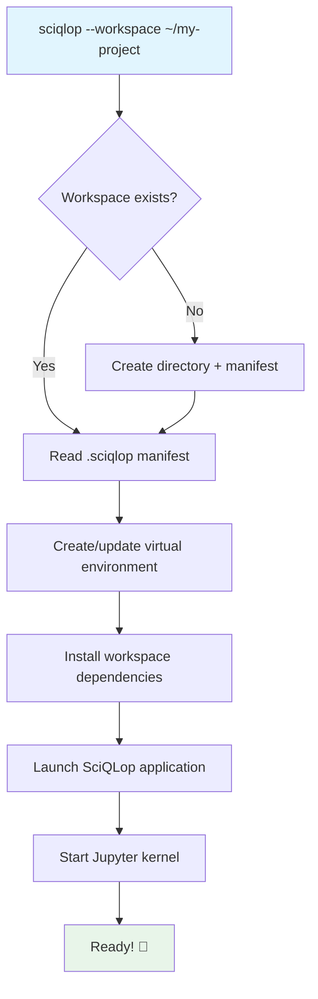
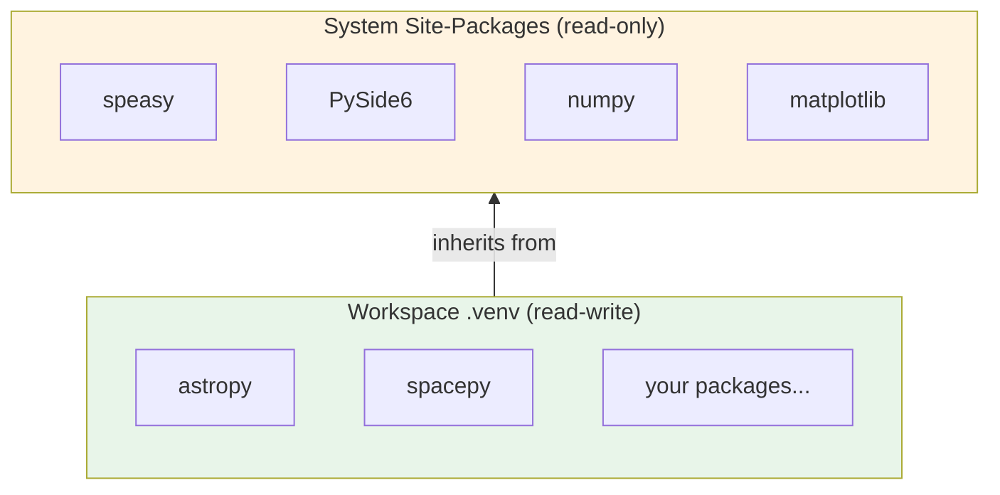
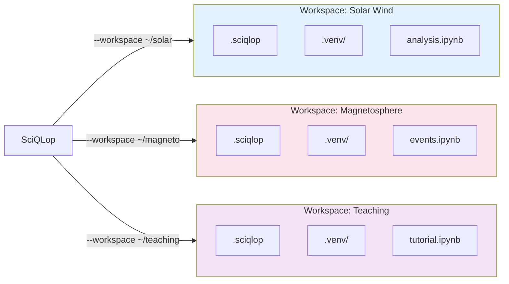
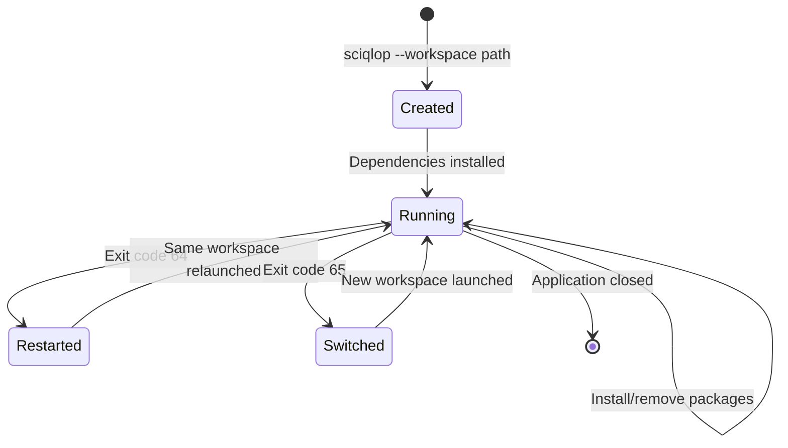

# Workspaces and Package Management in SciQLop

SciQLop uses **workspaces** to keep your projects organized and **uv** (a fast Python package manager) to manage dependencies. This guide explains how they work together.

## What is a Workspace?

A workspace is a directory where SciQLop stores everything related to a project:

- Your Jupyter notebooks and Python scripts
- A virtual environment with project-specific packages
- A manifest file (`.sciqlop`) that records your dependencies

Each workspace is independent — you can have one for magnetosphere research, another for solar wind analysis, and they won't interfere with each other.

## Quick Start

### Creating a Workspace

```bash
# Launch SciQLop with a new workspace
sciqlop --workspace ~/my-project

# Or from the welcome page, click "New Workspace"
```

The first time you open a workspace, SciQLop creates:

```
~/my-project/
├── .sciqlop              # Workspace manifest (TOML)
├── .venv/                # Virtual environment
└── (your notebooks, scripts, data...)
```

### Installing Packages

From the embedded Jupyter console, use the `%install` magic:

```python
%install astropy spacepy
```

This does two things:
1. Installs the packages immediately using uv
2. Records them in the `.sciqlop` manifest so they're automatically reinstalled next time you open the workspace

You can also install from a terminal, but packages won't be recorded in the manifest:

```bash
cd ~/my-project
uv pip install astropy
```

## How It Works

### Startup Sequence

When you launch SciQLop with a workspace, here's what happens behind the scenes:



### The `.sciqlop` Manifest

The manifest is a simple TOML file that tracks your workspace configuration:

```toml
[workspace]
name = "Magnetosphere Study"

[dependencies]
requires = ["astropy", "spacepy>=0.6"]
```

You don't need to edit this file by hand — the `%install` magic updates it automatically.

### Virtual Environment

Each workspace gets its own virtual environment with `--system-site-packages` enabled. This means:

1. **SciQLop's own packages** (speasy, PySide6, etc.) are always available
2. **Your workspace packages** are installed on top, without conflicts
3. **Different workspaces** can use different versions of the same library



When Python looks for a package, it checks the workspace `.venv` first, then falls back to the system packages. This lets you override versions if needed.

### Why uv?

SciQLop uses [uv](https://docs.astral.sh/uv/) instead of pip for package management because it's:

- **Fast** — 10-100x faster than pip for installs and dependency resolution
- **Reliable** — deterministic dependency resolution avoids "works on my machine" issues
- **Compatible** — drop-in replacement for pip, same package index (PyPI)

You don't need to install uv separately — SciQLop bundles it.

## Multiple Workspaces

You can work with multiple workspaces by launching SciQLop with different `--workspace` paths:



### Switching Workspaces

You can switch workspaces from the welcome page without restarting SciQLop manually — the application restarts itself with the new workspace.

### Default Workspace

If you launch SciQLop without `--workspace`, it uses a default workspace in `~/.local/share/sciqlop/default/`. This is fine for quick experiments but we recommend named workspaces for real projects.

## JupyterLab Integration

Each workspace comes with a built-in JupyterLab environment. You can open it as:

- **Docked widget** — from the Tools menu: *Tools → Open JupyterLab*
- **Browser tab** — from the Tools menu: *Tools → Open JupyterLab in browser*

The JupyterLab file browser shows your workspace directory, so your notebooks and data files are right there.

## Workspace Lifecycle



SciQLop uses a subprocess model for robustness — the launcher process survives workspace switches, so you can move between projects without fully restarting the application.

## Tips

- **Keep workspaces focused** — one workspace per research project or course
- **Use `%install`** in the Jupyter console to install packages — they're automatically recorded in the manifest
- **Share workspaces** — copy the `.sciqlop` file to let collaborators reproduce your environment
- **Workspace directory in `sys.path`** — Python scripts in your workspace directory can import each other directly
